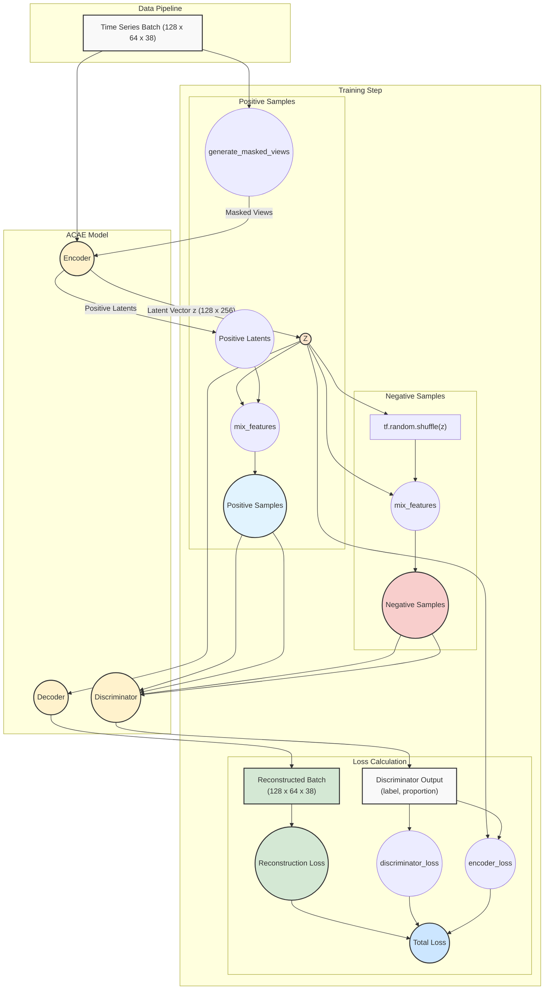

# ACAE Model Architecture

```mermaid
flowchart TD
 subgraph subGraph0["Data Pipeline"]
        Input["Time Series Batch (128 x 64 x 38)"]
  end
 subgraph subGraph1["ACAE Model"]
    direction LR
        Encoder(("Encoder"))
        Decoder(("Decoder"))
        Discriminator(("Discriminator"))
  end
 subgraph subGraph2["Positive Samples"]
        GMV(("generate_masked_views"))
        PosLatents(("Positive Latents"))
        MF1(("mix_features"))
        LatentZ(("Z"))
        PosSamples(("Positive Samples"))
  end
 subgraph subGraph3["Negative Samples"]
        Shuffle["tf.random.shuffle(z)"]
        MF2(("mix_features"))
        NegSamples(("Negative Samples"))
  end
 subgraph subGraph4["Loss Calculation"]
    direction LR
        DiscOut["Discriminator Output<br>(label, proportion)"]
        DL(("discriminator_loss"))
        EL(("encoder_loss"))
        ReconLoss(("Reconstruction Loss"))
        Reconstructed["Reconstructed Batch<br>(128 x 64 x 38)"]
        TL(("Total Loss"))
  end
 subgraph subGraph5["Training Step"]
        subGraph2
        subGraph3
        subGraph4
  end
    Input --> Encoder & GMV
    Encoder -- Latent Vector z (128 x 256) --> LatentZ
    GMV -- Masked Views --> Encoder
    Encoder -- Positive Latents --> PosLatents
    LatentZ --> MF1 & Shuffle & MF2 & EL & Decoder
    PosLatents --> MF1
    MF1 --> PosSamples
    Shuffle --> MF2
    MF2 --> NegSamples
    PosSamples --> Discriminator & Discriminator
    NegSamples --> Discriminator & Discriminator
    Discriminator --> DiscOut
    DiscOut --> DL & EL
    Decoder --> Reconstructed
    Reconstructed --> ReconLoss
    ReconLoss --> TL
    DL --> TL
    EL --> TL

    style Input fill:#f9f9f9,stroke:#333,stroke-width:2px
    style Encoder fill:#fff2cc,stroke:#333,stroke-width:2px
    style Decoder fill:#fff2cc,stroke:#333,stroke-width:2px
    style Discriminator fill:#fff2cc,stroke:#333,stroke-width:2px
    style LatentZ fill:#ffe6cc,stroke:#333,stroke-width:2px
    style PosSamples fill:#e1f3fe,stroke:#333,stroke-width:2px
    style NegSamples fill:#f8cecc,stroke:#333,stroke-width:2px
    style DiscOut fill:#f9f9f9,stroke:#333,stroke-width:2px
    style ReconLoss fill:#d4e8d4,stroke:#333,stroke-width:2px
    style Reconstructed fill:#d4e8d4,stroke:#333,stroke-width:2px
    style TL fill:#cce6ff,stroke:#333,stroke-width:2px


```

