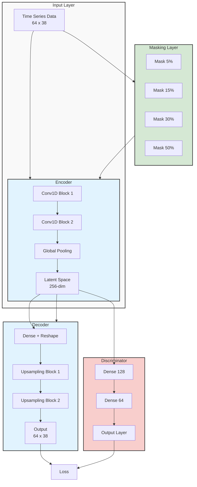

# ACAE Model Architecture

## Model Components

### Input Layer
- Time series data with 64 timesteps and 38 features
- Input shape: (64, 38)

### Masking Layer
- Applies different masking rates for contrastive learning:
  - 5% masking
  - 15% masking
  - 30% masking
  - 50% masking

### Encoder
- Conv1D blocks with residual connections
- Global pooling layer
- Projects to 256-dimensional latent space

### Decoder
- Dense layer with reshape operation
- Upsampling blocks
- Reconstructs original input dimensions (64, 38)

### Discriminator
- Dense layers (128 → 64)
- Output layer for adversarial training
