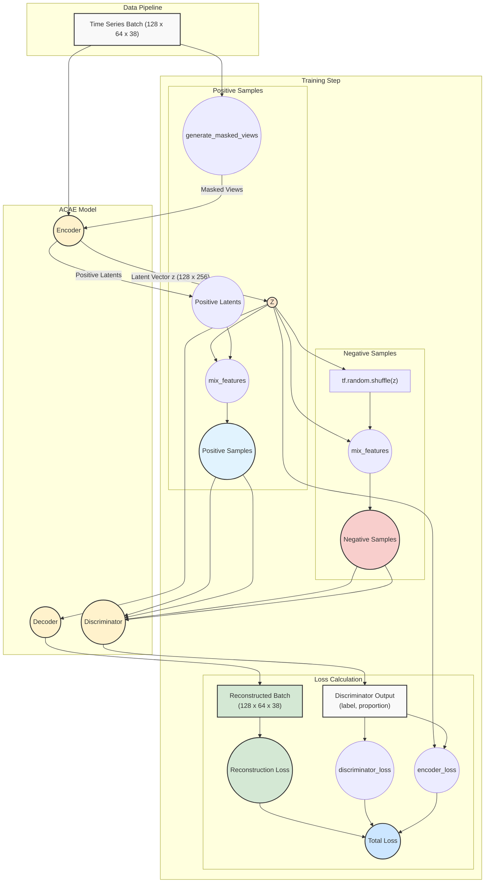

# ACAE Model Architecture

## Model Components

### Input Layer
- Time series data with 64 timesteps and 38 features
- Input shape: (64, 38)

### Data Split
- Original sample used as anchor
- Generates positive samples through masking
- Creates negative samples through augmentation/shuffling

### Masking Layer (Positive Sample Generation)
- Applies different masking rates for contrastive learning:
  - 5% masking
  - 15% masking
  - 30% masking
  - 50% masking

### Encoders
- Three parallel encoding paths:
  1. Anchor path: Processes original unmasked input
  2. Positive path: Processes masked versions of input
  3. Negative path: Processes negative samples
- Each encoder consists of:
  - Conv1D blocks with residual connections
  - Global pooling layer
  - Projects to 256-dimensional latent space

### Contrastive Learning
- Computes similarities between anchor-positive and anchor-negative pairs
- Maximizes agreement between anchor and positive samples
- Minimizes agreement between anchor and negative samples

### Decoder
- Dense layer with reshape operation
- Upsampling blocks
- Reconstructs original input dimensions (64, 38)
- Trained with reconstruction loss

### Discriminator
- Dense layers (128 → 64)
- Output layer for adversarial training
- Provides adversarial loss signal

### Loss Components
- Contrastive Loss: From triplet comparisons
- Reconstruction Loss: From decoder output
- Adversarial Loss: From discriminator
- Combined into total loss for training
