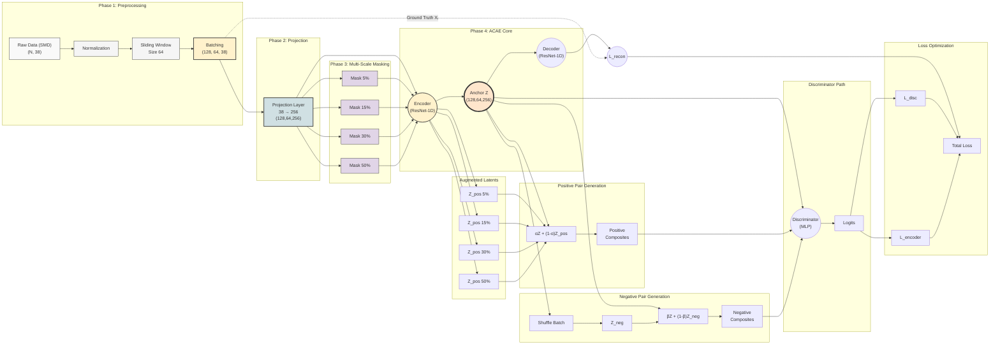

```mermaid
flowchart LR
 subgraph Prep["Phase 1: Preprocessing"]
    direction LR
        RawData["Raw Data (SMD)<br>(N, 38)"]
        Norm["Normalization"]
        Window["Sliding Window<br>Size 64"]
        Batch["Batching<br>(128, 64, 38)"]
  end
 subgraph Proj["Phase 2: Projection"]
        Projection["Projection Layer<br>38 → 256<br>(128,64,256)"]
  end
 subgraph Mask["Phase 3: Multi-Scale Masking"]
    direction LR
        M1["Mask 5%"]
        M2["Mask 15%"]
        M3["Mask 30%"]
        M4["Mask 50%"]
  end
 subgraph Core["Phase 4: ACAE Core"]
    direction LR
        Encoder(("Encoder<br>(ResNet-1D)"))
        LatentZ(("Anchor Z<br>(128,64,256)"))
        Decoder(("Decoder<br>(ResNet-1D)"))
  end
 subgraph Latents["Augmented Latents"]
    direction LR
        Z1["Z_pos 5%"]
        Z2["Z_pos 15%"]
        Z3["Z_pos 30%"]
        Z4["Z_pos 50%"]
  end
 subgraph PosGen["Positive Pair Generation"]
    direction LR
        MixPos["αZ + (1-α)Z_pos"]
        PosSamples["Positive<br>Composites"]
  end
 subgraph NegGen["Negative Pair Generation"]
    direction LR
        Shuffle["Shuffle Batch"]
        NegLatents["Z_neg"]
        MixNeg["βZ + (1-β)Z_neg"]
        NegSamples["Negative<br>Composites"]
  end
 subgraph Disc["Discriminator Path"]
    direction LR
        Discriminator(("Discriminator<br>(MLP)"))
        DiscOut["Logits"]
  end
 subgraph Loss["Loss Optimization"]
        DL["L_disc"]
        EL["L_encoder"]
        TL["Total Loss"]
  end
    RawData --> Norm
    Norm --> Window
    Window --> Batch
    Batch --> Projection
    Projection -- <br> --> M1 & M2 & M3 & Encoder & M4
    M1 --> Encoder
    M2 --> Encoder
    M3 --> Encoder
    M4 --> Encoder
    Encoder --> LatentZ & Z1 & Z2 & Z3 & Z4
    LatentZ --> MixPos & Shuffle & MixNeg & Discriminator & Decoder
    Z1 --> MixPos
    Z2 --> MixPos
    Z3 --> MixPos
    Z4 --> MixPos
    MixPos --> PosSamples
    Shuffle --> NegLatents
    NegLatents --> MixNeg
    MixNeg --> NegSamples
    PosSamples --> Discriminator
    NegSamples --> Discriminator
    Discriminator --> DiscOut
    Decoder --> ReconLoss(("L_recon"))
    Batch -. Ground Truth Xᵢ .-> ReconLoss
    DiscOut --> DL & EL
    ReconLoss --> TL
    DL --> TL
    EL --> TL

    style RawData fill:#f9f9f9,stroke:#333
    style Norm fill:#f5f5f5,stroke:#333
    style Window fill:#f5f5f5,stroke:#333
    style Batch fill:#fff2cc,stroke:#333,stroke-width:2px
    style Projection fill:#d0e0e3,stroke:#333,stroke-width:2px
    style M1 fill:#e1d5e7,stroke:#333
    style M2 fill:#e1d5e7,stroke:#333
    style M3 fill:#e1d5e7,stroke:#333
    style M4 fill:#e1d5e7,stroke:#333
    style Encoder fill:#fff2cc,stroke:#333,stroke-width:2px
    style LatentZ fill:#ffe6cc,stroke:#333,stroke-width:4px

    L_Projection_Encoder_0@{ animation: none }
```

