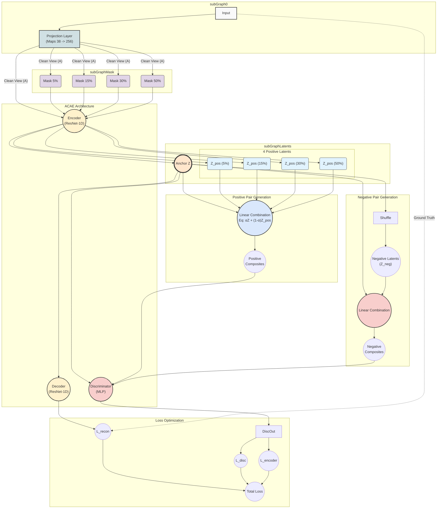

```mermaid
flowchart TD
 %% --- Data Preprocessing ---
 subgraph subGraph0
    Input
    Projection["Projection Layer<br>(Maps 38 -> 256)"]
 end

 %% --- Augmentation Module (Explicit Split) ---
 subgraph subGraphMask
    direction TB
    M1("Mask 5%")
    M2("Mask 15%")
    M3("Mask 30%")
    M4("Mask 50%")
 end

 %% --- Core Model ---
 subgraph subGraphModel["ACAE Architecture"]
    Encoder(("Encoder<br>(ResNet-1D)"))
    Decoder(("Decoder<br>(ResNet-1D)"))
    Discriminator(("Discriminator<br>(MLP)"))
 end

 %% --- Latent Space Expansion ---
 subgraph subGraphLatents
    LatentZ(("Anchor Z"))
    
    subgraph PosLatentGroup["4 Positive Latents"]
      Z1("Z_pos (5%)")
      Z2("Z_pos (15%)")
      Z3("Z_pos (30%)")
      Z4("Z_pos (50%)")
    end
 end

 %% --- Positive Pair Generation ---
 subgraph subGraphPos["Positive Pair Generation"]
        MixPos(("Linear Combination<br>Eq: αZ + (1-α)Z_pos"))
        PosSamples(("Positive<br>Composites"))
 end

 %% --- Negative Pair Generation ---
 subgraph subGraphNeg["Negative Pair Generation"]
        Shuffle
        NegLatents(("Negative Latents<br>(Z_neg)"))
        MixNeg(("Linear Combination"))
        NegSamples(("Negative<br>Composites"))
 end

 %% --- Loss Calculation ---
 subgraph subGraphLoss["Loss Optimization"]
        DiscOut
        DL(("L_disc"))
        EL(("L_encoder"))
        ReconLoss(("L_recon"))
        TL(("Total Loss"))
 end

    %% 1. Input Flow
    Input --> Projection
    
    %% 2. Split: Clean vs Masked Paths
    Projection -- "Clean View (A)" --> Encoder
    Projection -- "Clean View (A)" --> M1 & M2 & M3 & M4
    
    %% 3. Masked Views into Encoder
    M1 --> Encoder
    M2 --> Encoder
    M3 --> Encoder
    M4 --> Encoder

    %% 4. Encoder Outputs (1 Anchor + 4 Positives)
    Encoder --> LatentZ
    Encoder --> Z1 & Z2 & Z3 & Z4

    %% 5. Positive Mixing (All 5 vectors converge)
    LatentZ --> MixPos
    Z1 --> MixPos
    Z2 --> MixPos
    Z3 --> MixPos
    Z4 --> MixPos
    MixPos --> PosSamples

    %% 6. Negative Mixing
    LatentZ --> Shuffle
    LatentZ --> MixNeg
    Shuffle --> NegLatents
    NegLatents --> MixNeg
    MixNeg --> NegSamples

    %% 7. Discriminator (Needs Anchor + Composites)
    LatentZ --> Discriminator
    PosSamples --> Discriminator
    NegSamples --> Discriminator
    Discriminator --> DiscOut

    %% 8. Reconstruction
    LatentZ --> Decoder
    Decoder --> ReconLoss
    Input -. "Ground Truth".-> ReconLoss

    %% 9. Loss Aggregation
    DiscOut --> DL & EL
    ReconLoss --> TL
    DL --> TL
    EL --> TL

    %% Styling
    style Input fill:#f9f9f9,stroke:#333,stroke-width:2px
    style Projection fill:#d0e0e3,stroke:#333,stroke-width:2px
    style M1 fill:#e1d5e7,stroke:#333
    style M2 fill:#e1d5e7,stroke:#333
    style M3 fill:#e1d5e7,stroke:#333
    style M4 fill:#e1d5e7,stroke:#333
    style Encoder fill:#fff2cc,stroke:#333,stroke-width:2px
    style Decoder fill:#fff2cc,stroke:#333,stroke-width:2px
    style Discriminator fill:#f8cecc,stroke:#333,stroke-width:2px
    style LatentZ fill:#ffe6cc,stroke:#333,stroke-width:4px
    style Z1 fill:#e1f3fe,stroke:#333
    style Z2 fill:#e1f3fe,stroke:#333
    style Z3 fill:#e1f3fe,stroke:#333
    style Z4 fill:#e1f3fe,stroke:#333
    style MixPos fill:#dae8fc,stroke:#333,stroke-width:2px
    style MixNeg fill:#f8cecc,stroke:#333,stroke-width:2px
```

