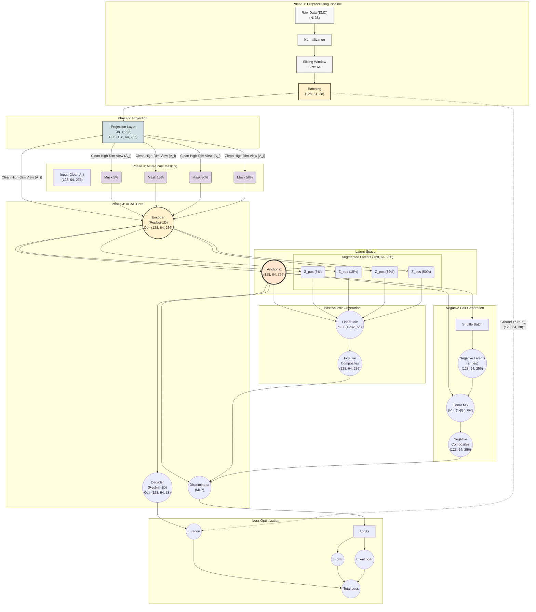

```mermaid
flowchart TD
 %% --- Phase 1: Data Preprocessing (Before Model) ---
 subgraph subGraphPrep["Phase 1: Preprocessing Pipeline"]
    RawData["Raw Data (SMD)<br>(N, 38)"]
    Norm["Normalization"]
    Window["Sliding Window<br>Size: 64"]
    Batch["Batching<br>(128, 64, 38)"]
 end

 %% --- Phase 2: Input Projection ---
 subgraph subGraphProj["Phase 2: Projection"]
    Projection["Projection Layer<br>38 -> 256<br>Out: (128, 64, 256)"]
 end

 %% --- Phase 3: Augmentation ---
 subgraph subGraphMask["Phase 3: Multi-Scale Masking"]
    direction TB
    noteMask["Input: Clean A_i<br>(128, 64, 256)"]
    M1("Mask 5%")
    M2("Mask 15%")
    M3("Mask 30%")
    M4("Mask 50%")
 end

 %% --- Phase 4: Core Model ---
 subgraph subGraphModel["Phase 4: ACAE Core"]
    Encoder(("Encoder<br>(ResNet-1D)<br>Out: (128, 64, 256)"))
    Decoder(("Decoder<br>(ResNet-1D)<br>Out: (128, 64, 38)"))
    Discriminator(("Discriminator<br>(MLP)"))
 end

 %% --- Latent Space ---
 subgraph subGraphLatents["Latent Space"]
    LatentZ(("Anchor Z<br>(128, 64, 256)"))
    
    subgraph PosLatentGroup["Augmented Latents (128, 64, 256)"]
      Z1("Z_pos (5%)")
      Z2("Z_pos (15%)")
      Z3("Z_pos (30%)")
      Z4("Z_pos (50%)")
    end
 end

 %% --- Pair Generation ---
 subgraph subGraphPos["Positive Pair Generation"]
    MixPos(("Linear Mix<br>αZ + (1-α)Z_pos"))
    PosSamples(("Positive<br>Composites<br>(128, 64, 256)"))
 end

 subgraph subGraphNeg["Negative Pair Generation"]
    Shuffle["Shuffle Batch"]
    NegLatents(("Negative Latents<br>(Z_neg)<br>(128, 64, 256)"))
    MixNeg(("Linear Mix<br>βZ + (1-β)Z_neg"))
    NegSamples(("Negative<br>Composites<br>(128, 64, 256)"))
 end

 %% --- Loss ---
 subgraph subGraphLoss["Loss Optimization"]
    DiscOut["Logits"]
    DL(("L_disc"))
    EL(("L_encoder"))
    ReconLoss(("L_recon"))
    TL(("Total Loss"))
 end

    %% Flow Connections
    %% 1. Preprocessing
    RawData --> Norm --> Window --> Batch
    
    %% 2. Projection
    Batch --> Projection
    
    %% 3. Split: Clean vs Masked
    Projection -- "Clean High-Dim View (A_i)" --> Encoder
    Projection -- "Clean High-Dim View (A_i)" --> M1 & M2 & M3 & M4
    
    %% 4. Masking
    M1 --> Encoder
    M2 --> Encoder
    M3 --> Encoder
    M4 --> Encoder

    %% 5. Encoder Outputs
    Encoder --> LatentZ
    Encoder --> Z1 & Z2 & Z3 & Z4

    %% 6. Positive Mixing
    LatentZ --> MixPos
    Z1 --> MixPos
    Z2 --> MixPos
    Z3 --> MixPos
    Z4 --> MixPos
    MixPos --> PosSamples

    %% 7. Negative Mixing
    LatentZ --> Shuffle
    Shuffle --> NegLatents
    LatentZ --> MixNeg
    NegLatents --> MixNeg
    MixNeg --> NegSamples

    %% 8. Discriminator
    LatentZ --> Discriminator
    PosSamples --> Discriminator
    NegSamples --> Discriminator
    Discriminator --> DiscOut

    %% 9. Reconstruction
    LatentZ --> Decoder
    Decoder --> ReconLoss
    Batch -. "Ground Truth X_i<br>(128, 64, 38)".-> ReconLoss

    %% 10. Loss Aggregation
    DiscOut --> DL & EL
    ReconLoss --> TL
    DL --> TL
    EL --> TL

    %% Styling
    style RawData fill:#f9f9f9,stroke:#333
    style Norm fill:#f5f5f5,stroke:#333
    style Window fill:#f5f5f5,stroke:#333
    style Batch fill:#fff2cc,stroke:#333,stroke-width:2px
    style Projection fill:#d0e0e3,stroke:#333,stroke-width:2px
    style M1 fill:#e1d5e7,stroke:#333
    style M2 fill:#e1d5e7,stroke:#333
    style M3 fill:#e1d5e7,stroke:#333
    style M4 fill:#e1d5e7,stroke:#333
    style Encoder fill:#fff2cc,stroke:#333,stroke-width:2px
    style LatentZ fill:#ffe6cc,stroke:#333,stroke-width:4px
```

